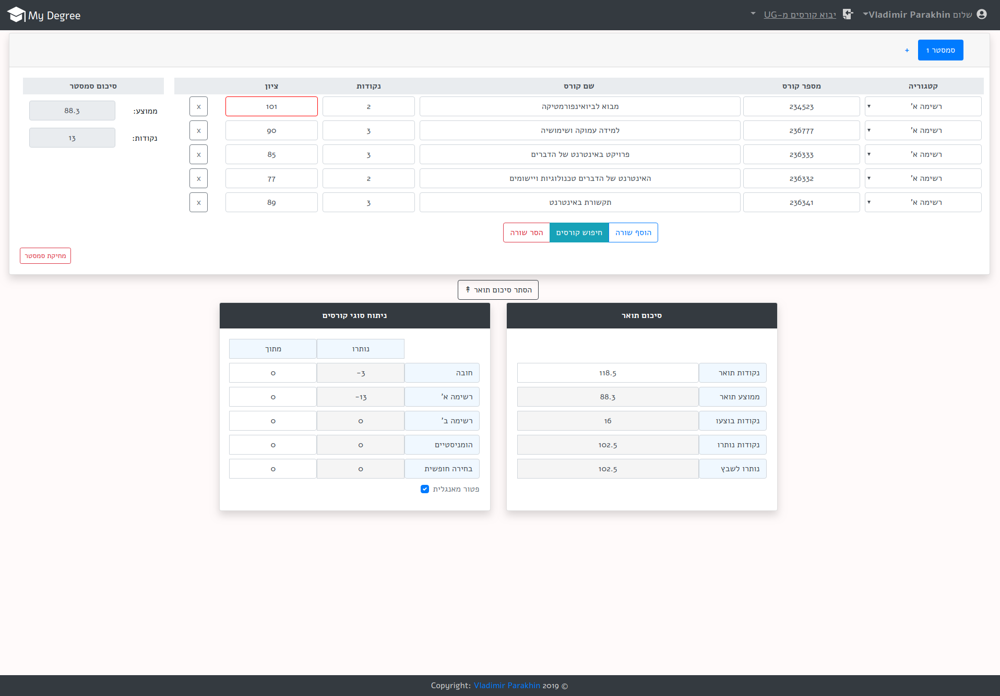
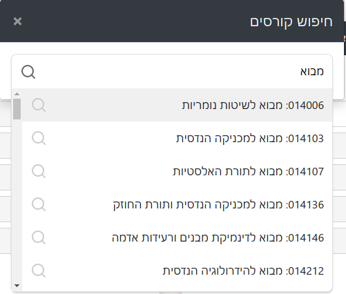
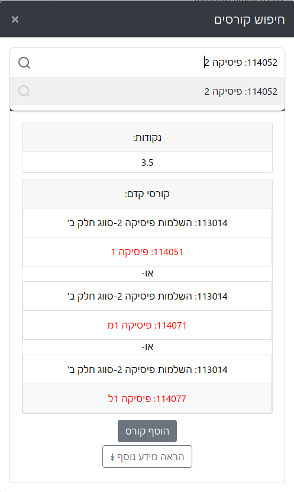
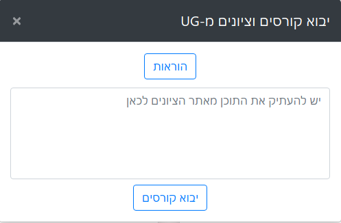

# [My Degree](https://mydegree.co.il)
It is an web application made to ease the degree planning of Technion students.

## Features

- Track per semester's average and degree's average.

- Search/Add courses using up  courses database.

- Check pre-requisites/parallel courses on addition.

- Import courses with grades from UG.

- Search/Add courses using up to date UG based courses database.

- Tracking of various course types points done.

- Synchronize account across different devices using google sign-in or email account.

- Keep track of various courses types.

## Screenshots

### Courses view

### Courses search

### Course pre-requisites/parallel check

### Import from UG

## Contributing
Pull requests are welcome. For major changes, please open an issue first to discuss what you would like to change.

## License
[GNU GPL 3.0](LICENSE.MD )
